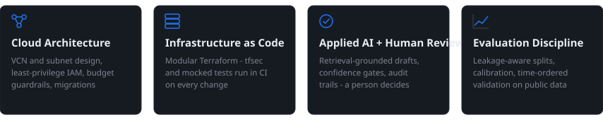
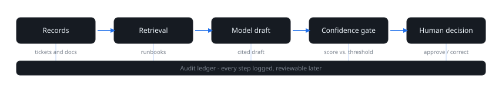

**OCI Architect at Oracle** — cloud architecture, Terraform and applied AI, with an emphasis on traceability and human review.

I design OCI infrastructure — VCN and subnet design, IAM policy, migrations — and study how cloud AI services fit into review-first workflows. The repositories below are independent portfolio simulations: tested offline, documented honestly, and not live tenancy deployments.

## Research focus



## The pattern I keep coming back to

Useful AI in production is review-first: retrieve the right context, draft with citations, gate on confidence, and let a person make the call — with every step logged.



## Selected work

| Project | Focus | Methods |
| --- | --- | --- |
| [Terraform OCI Landing Zone](https://github.com/rajatkumarpradhan/terraform-oci-landing-zone) | OCI network and IAM foundation across dev/prod | Modular Terraform; mocked `terraform test` and tfsec in CI; not applied to a live tenancy |
| [OCI Incident Intelligence](https://github.com/rajatkumarpradhan/oci-incident-intelligence) | Incident intake and triage | Deterministic retrieval baseline, duplicate queue, cited review drafts; optional, untested OCI AI path |
| [OCI Document Risk Review](https://github.com/rajatkumarpradhan/oci-document-risk-review) | Invoice review with an audit trail | Confidence gates, policy checks, corrections, SQLite audit ledger; optional, untested OCI Document Understanding path |
| [Cytology Evidence Lab](https://github.com/rajatkumarpradhan/cytology-evidence-lab) | Medical-imaging ML workflow | Leakage-aware validation, calibration, evidence-grounded local Q&A; research demo, not for clinical use |
| [Term Deposit Campaign Analysis](https://github.com/rajatkumarpradhan/term-deposit-campaign-analysis) | Marketing campaign analytics | Time-ordered validation, capacity-constrained batch ranking; historical public data |


## How I work

1. **Offline before claims** — tfsec, mocked `terraform test` and recorded fixtures in CI; nothing ships on a hunch.
2. **Least privilege by default** — IAM scoped to the task; budgets as guardrails, not afterthoughts.
3. **AI assists, a person decides** — confidence gates and human sign-off on anything outward-facing.
4. **Honest documentation** — every README states what was tested and what was not.

## Right now

- **Currently exploring** — OCI AI service patterns for review-first document and incident workflows, exercised offline against recorded fixtures, with no live-tenancy spend.
- **Roadmap** — open issues and next steps live on my [project board](https://github.com/users/rajatkumarpradhan/projects/1).

## Referencing this work

These repositories are portfolio simulations built for study. If you reuse something, link back to the repository — and test it against your own tenancy before trusting it.

```bibtex
@misc{pradhan-oci-portfolio,
  author = {Pradhan, Rajat Kumar},
  title  = {OCI Architecture and Applied AI: Portfolio Simulations},
  year   = {2026},
  url    = {https://github.com/rajatkumarpradhan}
}
```

## Stack

        


[LinkedIn](https://www.linkedin.com/in/rajatpradhan021) · [Instagram](https://www.instagram.com/drayvenn._) · Bengaluru, India
